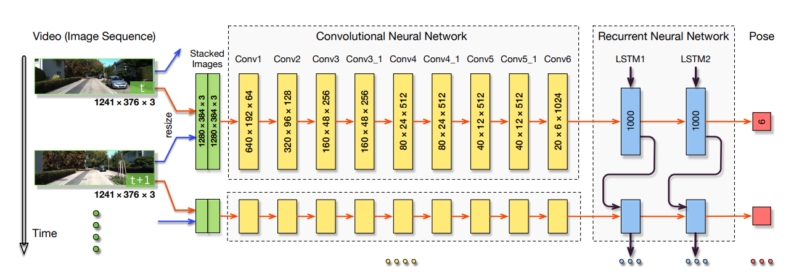
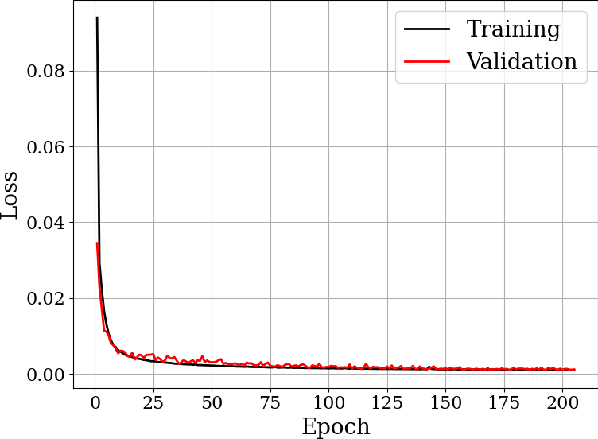
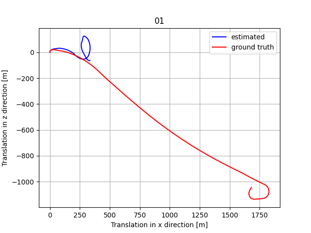
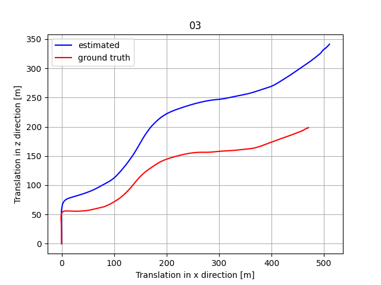
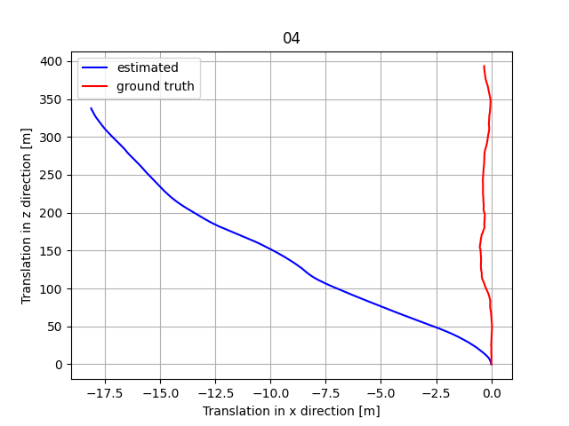
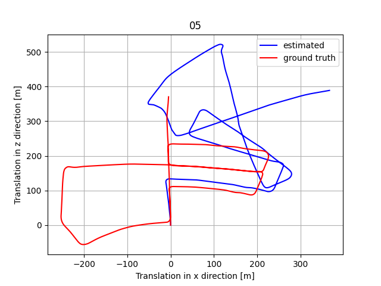
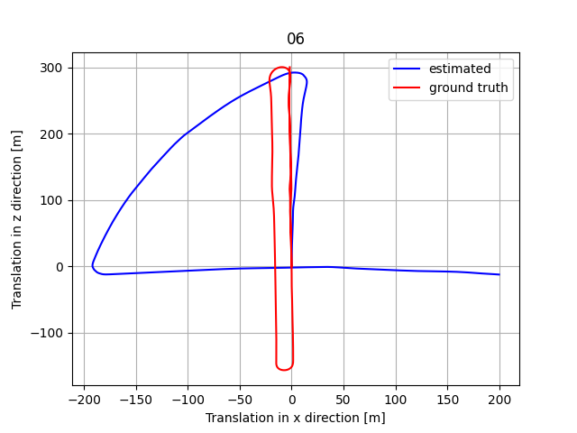
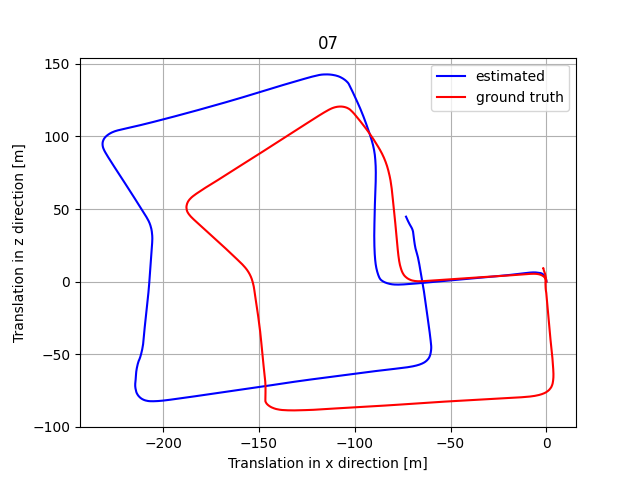
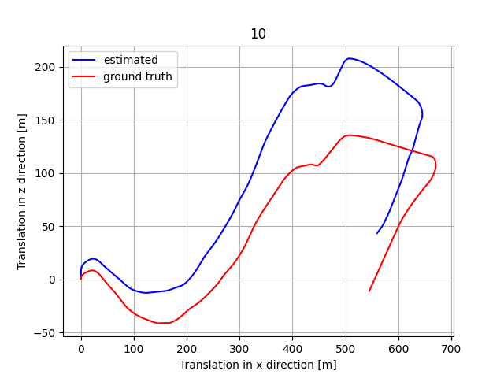

# DeepVO - Unofficial PyTorch Implementation

This repository contains an unofficial PyTorch implementation of **DeepVO: Towards End-to-End Visual Odometry with Deep Recurrent Convolutional Neural Networks**. This code is tailored to train and evaluate the DeepVO model for visual odometry tasks, with configurations and scripts for easy experimentation.

<figure>
   
   <figcaption>[Source]: DeepVO model architecture. Extracted from the original DeepVO paper.</figcaption>
</figure>

---


## Implementation Details:
- **Input Resolution**
    - Due to the architecture, the input size must be a **multiple of 64**.
    - The paper does not specify the input size used, but in the figure, we see `(1280 x 384 x 3)`.
    - We are using half of this: `(640 x 192 x 3)`.

- **Optimiser**
    - The authors mention "*Adagrad optimiser is employed to train the network for up to 200 epochs with learning rate 0.001*"

- **Normalization**
    - The authors do not specify normalization of the ground truth poses. Since they use a weighted MSE loss with a scale factor of $\kappa=100$ (high value), we assume they do not apply standard normalization.
    - Seeing the y-axis of the training/validation losses in Fig. 4 would provide more clarity.

- **Dropout**
    - The authors mention "*Dropout and early stopping techniques are introduced to prevent the models from overfitting*", but they provide no further details.
    - We tested with `lstm_dropout = 0.2` and `conv_dropout = 0.2`.

---

## 1. Dataset
Download the KITTI dataset directly from the [KITTI website](https://www.cvlibs.net/datasets/kitti/eval_odometry.php). 
Ensure the dataset is organized as specified for ease of data loading.

## 2. Pre-trained Models

**Pre-trained FlowNet**: 

Download the pre-trained FlowNet from [ClementPinard/FlowNetPytorch](https://github.com/ClementPinard/FlowNetPytorch).
- More specifically, download [flownets_from_caffe.pth](https://drive.google.com/drive/folders/16eo3p9dO_vmssxRoZCmWkTpNjKRzJzn5).
- Save in `checkpoints/flownet/flownets_from_caffe.pth` to use the default config, otherwise change the key `flownet_checkpoint` in the config file (`configs/exp.json`).

**Trained DeepVO**: 

You can download my trained DeepVO model here [DeepVO/checkpoints](https://drive.google.com/drive/folders/1IPyVflyvUULq1Cwy-M4Qe25q09k7qROD?usp=sharing)

## 3. Setup Environment

Create a virtual environment to install dependencies (tested on Python 3.12.7):

```bash
# Create a new conda environment
conda create -n deepvo python=3.12.7

# Activate the environment
conda activate deepvo

# Install dependencies
pip install -r requirements.txt
```

## 4. Usage
Configurations are read from `.json` files located in the `configs/` directory. Specify your experiment settings in `configs/exp.json` or create custom configuration files as needed.

---

### 4.1 Train 

To train the model, run in modular mode:

``` bash
python -m scripts.train --config <path_to_config>

#Example using the "exp1.json" configuration
python -m scripts.train --config configs/exp1.json
```

---

### 4.2 Test

Run model inference with:

```bash
python -m scripts.test <path_to_config> <checkpoint_name>

#Example for the "exp1.json" configuration and the "checkpoint_best"
python -m scripts.test configs/exp1.json checkpoint_best
```

---

### 4.3 Plot Results

After completing inferences, you can visualize the predicted trajectories by running:

```bash
python -m scripts.plot_results <path_to_config> <checkpoint_name>
```

---

### 4.4 Visualize Learning Curves

Launch TensorBoard to monitor training:

```bash
python -m utils.visualize_tensorboard --log_dir <path_to_desired_checkpoint>

#Example for the "exp1" experiment
python -m utils.visualize_tensorboard --log_dir checkpoints/exp1
```

## 5. Results

### Learning Curve:

<div style="flex: 1; margin: 3px; text-align: left;">
    
</div>

### Inferences in the Test Sequences (checkpoint@epoch190):

| **Sequence 01**                     | **Sequence 03**                     | **Sequence 04**                     | **Sequence 05**                     |
|-------------------------------------|-------------------------------------|-------------------------------------|-------------------------------------|
|  |  |  |  |

| **Sequence 06**                     | **Sequence 07**                     | **Sequence 10**                    |
|-------------------------------------|-------------------------------------|-------------------------------------|
|  |  |  |

## 6. Reference

Original DeepVO paper: 

*Wang, Sen, et al. "Deepvo: Towards end-to-end visual odometry with deep recurrent convolutional neural networks." 2017 IEEE international conference on robotics and automation (ICRA). IEEE, 2017.*


